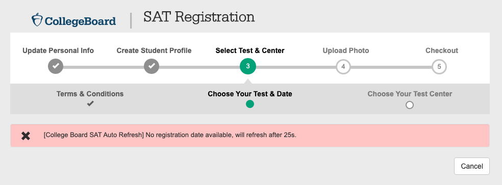

# College Board SAT Auto Registration

Your helper in College Board SAT registration

SAT is a registered trademark of the College Board, and this project is not affliated with either the College Board or SAT.

This plugin currently only supports international registration, but it can be easily adapted for test centers within the U.S.

Current version: 38

Features
---
- Continue to fill the personal information from the initial page
- Auto login to specified account
- Skip filling of personal information
- Accept the terms
- Brute mode with no refresh interval
- Check if any registration date is available
- Auto select a date
- Select a country from the dropdown menu
- Search for a better test center with certain address
- Select a test center and go to the payment page
- Check if any seat is available in the region you selected
- Skip uploading of new photo
- Skip buying practice materials
- Notify you during the seat is being held
- Auto pay for the new test using a credit card (disabled, to fix)
- Refresh when the website is down
- Notify using sound with no jam (backend needed)
- Handle errors intelligently (backend needed)
- Log the status (backend needed)
- Notify when idle
- Support SAT, SAT essay, SAT Subject Tests, fee waiver, and student answer service
- Support changes to existed registration

Basic Usage
---
1. Use [Tampermonkey](https://chrome.google.com/webstore/detail/tampermonkey/dhdgffkkebhmkfjojejmpbldmpobfkfo) on Chromium-based browsers (e.g. Chrome on PCs and Yandex Browser Beta on Android devices) to load the content in [front.js](front.js);
2. Allow the plugin to access the host (localhost by default);
3. Grant sound permissions for https://nsat.collegeboard.org/, https://pps.collegeboard.org/, and https://account.collegeboard.org/ (or the plugin would get stuck);
4. Go to https://nsat.collegeboard.org/satweb/satHomeAction.action, sign in, and click *Auto Registration Settings*;
5. Answer the questions to enable the features you need.

Advanced Usage
---
1. Do all steps of *Basic Usage*;
2. Ensure the version numbers of the frontend and the backend are identical and latest;
3. Install all needed Python packages from PIP;
4. Run the backend on the host specified in the last question of the frontend.

Screenshots
---

